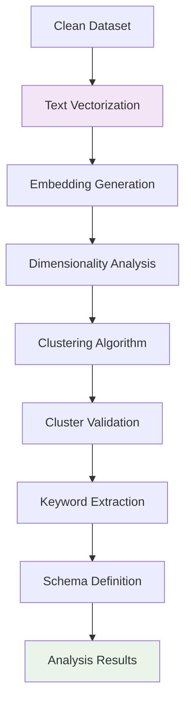

# Data Analysis: Pattern Discovery and Schema Extraction

## Phase Overview

The data analysis phase uncovered hidden patterns and structures within the cleaned job market data. Using advanced machine learning techniques, we transformed text descriptions into meaningful insights, identifying skill clusters and extracting representative keywords that reveal the underlying structure of the data science job market.

## Input Data Foundation

### Clean Dataset Requirements

- **Quality-assured text**: Preprocessed job descriptions from cleaning phase
- **Structured metadata**: Standardized job attributes and categories
- **Temporal consistency**: Properly handled posting dates and updates

### Analysis Objectives

- **Pattern identification**: Discover latent structures in job descriptions
- **Skill clustering**: Group similar roles and requirements
- **Schema extraction**: Identify representative characteristics for each cluster
- **Market segmentation**: Understand distinct job market segments

## Analysis Pipeline Architecture



## Analysis Stages

### 1. Text Vectorization

- **Semantic representation**: Convert text to numerical vectors
- **Context preservation**: Maintain meaning relationships between words
- **Dimensionality optimization**: Balance richness with computational efficiency

### 2. Embedding Generation

- **725-dimensional vectors**: Rich semantic representation of job descriptions
- **Transformer models**: Capture complex language patterns and relationships
- **Context-aware encoding**: Understand job requirements in full context

### 3. Clustering Analysis

- **K-means algorithm**: Unsupervised grouping of similar job descriptions
- **Distance metrics**: Measure semantic similarity between job postings
- **Cluster optimization**: Determine optimal number of skill groups

### 4. Cluster Validation

- **Quality assessment**: Evaluate clustering coherence and separation
- **Interpretability**: Ensure clusters represent meaningful job categories
- **Stability testing**: Validate consistency across different runs

### 5. Keyword Extraction

- **Representative terms**: Identify characteristic words for each cluster
- **TF-IDF weighting**: Prioritize distinctive and frequent terms
- **Skill identification**: Extract technical and soft skill requirements

### 6. Schema Definition

- **Category naming**: Assign meaningful labels to job clusters
- **Characteristic profiles**: Define typical requirements and responsibilities
- **Market positioning**: Understand relative value and demand patterns

## Technical Implementation

### Machine Learning Pipeline

```python
import pandas as pd
import numpy as np
from sklearn.cluster import KMeans
from sklearn.metrics import silhouette_score, calinski_harabasz_score
from sklearn.feature_extraction.text import TfidfVectorizer
from sentence_transformers import SentenceTransformer
import matplotlib.pyplot as plt
from typing import List, Dict, Tuple, Optional

class JobMarketAnalyzer:
    """
    Advanced analysis pipeline for job market pattern discovery.
    """

    def __init__(self, embedding_model: str = 'all-MiniLM-L6-v2'):
        self.embedding_model = SentenceTransformer(embedding_model)
        self.vectorizer = TfidfVectorizer(
            max_features=1000,
            stop_words='english',
            ngram_range=(1, 2)
        )
        self.kmeans_model = None
        self.optimal_clusters = None

    def analyze_patterns(self, clean_data: pd.DataFrame) -> Dict:
        """
        Complete pattern analysis pipeline.
        """
        # Generate embeddings
        embeddings = self.generate_embeddings(clean_data)

        # Find optimal clustering
        optimal_k = self.find_optimal_clusters(embeddings)
        self.optimal_clusters = optimal_k

        # Apply clustering
        cluster_labels = self.apply_clustering(embeddings, optimal_k)

        # Extract keywords
        cluster_keywords = self.extract_cluster_keywords(clean_data, cluster_labels)

        # Validate results
        validation_metrics = self.validate_clustering(embeddings, cluster_labels)

        return {
            'embeddings': embeddings,
            'cluster_labels': cluster_labels,
            'keywords': cluster_keywords,
            'validation': validation_metrics,
            'optimal_k': optimal_k
        }

    def generate_embeddings(self, data: pd.DataFrame) -> np.ndarray:
        """Generate 725-dimensional embeddings from job descriptions"""
        descriptions = data['description'].fillna('').tolist()
        embeddings = self.embedding_model.encode(descriptions)
        return embeddings

    def find_optimal_clusters(self, embeddings: np.ndarray,
                            k_range: Tuple[int, int] = (3, 15)) -> int:
        """Determine optimal number of clusters using validation metrics"""
        best_score = -1
        optimal_k = k_range[0]

        for k in range(k_range[0], k_range[1] + 1):
            kmeans = KMeans(n_clusters=k, random_state=42, n_init=10)
            labels = kmeans.fit_predict(embeddings)

            # Use combination of silhouette and Calinski-Harabasz scores
            sil_score = silhouette_score(embeddings, labels)
            ch_score = calinski_harabasz_score(embeddings, labels)
            combined_score = (sil_score + ch_score / 1000) / 2

            if combined_score > best_score:
                best_score = combined_score
                optimal_k = k

        return optimal_k

    def apply_clustering(self, embeddings: np.ndarray, n_clusters: int) -> np.ndarray:
        """Apply K-means clustering to embeddings"""
        self.kmeans_model = KMeans(
            n_clusters=n_clusters,
            random_state=42,
            n_init=10
        )
        cluster_labels = self.kmeans_model.fit_predict(embeddings)
        return cluster_labels

    def extract_cluster_keywords(self, data: pd.DataFrame,
                               cluster_labels: np.ndarray,
                               top_n: int = 10) -> Dict[int, List[str]]:
        """Extract representative keywords for each cluster"""
        cluster_keywords = {}

        for cluster_id in range(self.optimal_clusters):
            cluster_mask = cluster_labels == cluster_id
            cluster_texts = data.loc[cluster_mask, 'description'].fillna('')

            if len(cluster_texts) > 0:
                # Fit vectorizer on cluster texts
                tfidf_matrix = self.vectorizer.fit_transform(cluster_texts)
                feature_names = self.vectorizer.get_feature_names_out()

                # Get top keywords by TF-IDF score
                mean_tfidf = tfidf_matrix.mean(axis=0).A1
                top_indices = mean_tfidf.argsort()[-top_n:][::-1]
                keywords = [feature_names[i] for i in top_indices]

                cluster_keywords[cluster_id] = keywords

        return cluster_keywords

    def validate_clustering(self, embeddings: np.ndarray,
                          cluster_labels: np.ndarray) -> Dict[str, float]:
        """Validate clustering quality with multiple metrics"""
        sil_score = silhouette_score(embeddings, cluster_labels)
        ch_score = calinski_harabasz_score(embeddings, cluster_labels)

        # Calculate cluster sizes
        unique_labels, counts = np.unique(cluster_labels, return_counts=True)
        cluster_sizes = dict(zip(unique_labels, counts))

        return {
            'silhouette_score': sil_score,
            'calinski_harabasz_score': ch_score,
            'cluster_sizes': cluster_sizes,
            'num_clusters': len(unique_labels)
        }
```

## Pattern Discovery Insights

### Cluster Characteristics

- **Skill-based segmentation**: Groups reflect different technical specializations
- **Experience levels**: Natural separation by seniority and complexity
- **Industry focus**: Domain-specific requirements and emphases

### Market Structure Understanding

- **Demand patterns**: Which skills are most requested across clusters
- **Salary correlations**: How different clusters relate to compensation
- **Growth trends**: Emerging vs. established skill areas

### Validation Results

- **Clustering quality**: Quantitative measures of pattern coherence
- **Interpretability**: Human-understandable cluster characteristics
- **Stability**: Consistency of patterns across different analyses

## Output Analysis Structure

The analysis phase produces:

- **Cluster assignments**: Each job mapped to its skill-based category
- **Keyword profiles**: Representative skills and requirements per cluster
- **Embedding coordinates**: 725-dimensional vector representations
- **Validation metrics**: Quality scores for clustering reliability
- **Market insights**: Patterns and trends in job market structure

## Foundation for Presentation

### Visualization Enablement

- **t-SNE compatibility**: High-dimensional embeddings ready for 2D/3D projection
- **Interactive filtering**: Cluster-based navigation and exploration
- **Dashboard integration**: Structured data for dynamic visualizations

### Decision Support

- **Career guidance**: Clear skill requirements by job category
- **Market intelligence**: Understanding of job market segments
- **Trend analysis**: Temporal patterns in skill demand

## Navigation

Explore each analysis stage in detail:

- **[Embeddings](./embeddings)**: Vector representation generation
- **[Clustering](./clustering)**: K-means grouping analysis
- **[Keyword Tagging](./keyword-tagging)**: Skill extraction and categorization
- **[Cluster Analysis](./cluster-analysis)**: Quality assessment and filtering recommendations
