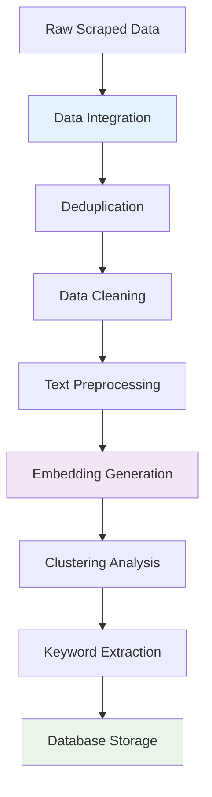

# Data Cleaning: From Raw Scrapes to Analysis-Ready Data

## Phase Overview

The data cleaning phase transformed our raw scraped data into a structured, analysis-ready dataset. This critical preprocessing step addressed the challenges of combining multiple data sources, removing duplicates, and preparing text for advanced machine learning analysis.

## Input Data Challenges

### Multiple Data Sources
- **Instant Data Scraper**: Structured tabular data (titles, companies, locations, salaries)
- **WebScraper.io**: Unstructured text data (full job descriptions)
- **Format inconsistencies**: Different CSV structures, encoding issues, missing fields

### Data Quality Issues
- **Duplicate entries**: Same job posted by multiple scrapers or reposted by employers
- **Missing values**: Incomplete job postings, optional fields not filled
- **Inconsistent formatting**: Varying date formats, salary representations, location names
- **Noise data**: Irrelevant jobs, spam postings, outdated listings

### Text Processing Requirements
- **Raw descriptions**: Unstructured text requiring normalization
- **HTML artifacts**: Leftover formatting tags and special characters
- **Language mixing**: German and English content requiring standardization

## Processing Pipeline Architecture



## Processing Stages

### 1. Data Integration & Combining
- **Source alignment**: Match records from different scraping tools
- **Schema unification**: Create consistent data structure
- **Field mapping**: Standardize column names and data types

### 2. Deduplication
- **Similarity matching**: Identify duplicate job postings
- **Content comparison**: Fuzzy matching on job titles and descriptions
- **Temporal handling**: Manage reposted jobs with updated dates

### 3. Data Cleaning
- **Missing value handling**: Imputation strategies for incomplete data
- **Format standardization**: Normalize dates, salaries, locations
- **Outlier detection**: Identify and handle anomalous data points

### 4. Text Preprocessing
- **HTML cleaning**: Remove markup and formatting artifacts
- **Text normalization**: Standardize case, remove special characters
- **Language processing**: Handle multilingual content appropriately

### 5. Feature Engineering
- **Embedding generation**: Convert text to 725-dimensional vectors
- **Metadata extraction**: Derive additional features from existing data
- **Categorical encoding**: Prepare categorical variables for analysis

### 6. Clustering & Analysis
- **K-means clustering**: Group similar job descriptions
- **Cluster validation**: Evaluate clustering quality and interpretability
- **Keyword extraction**: Identify representative terms for each cluster

### 7. Database Integration
- **Schema design**: Create optimized database structure
- **Data relationships**: Establish connections between jobs, clusters, keywords
- **Indexing strategy**: Optimize query performance

## Technical Implementation

### Python-Based Processing Pipeline

```python
import pandas as pd
import numpy as np
from sklearn.feature_extraction.text import TfidfVectorizer
from sklearn.cluster import KMeans
from sklearn.preprocessing import StandardScaler
import re
from typing import List, Dict, Tuple

class JobMarketDataProcessor:
    """
    Comprehensive data processing pipeline for job market analysis.
    """

    def __init__(self):
        self.vectorizer = TfidfVectorizer(
            max_features=725,
            stop_words='english',
            ngram_range=(1, 2)
        )
        self.scaler = StandardScaler()

    def process_pipeline(self, raw_data_path: str) -> pd.DataFrame:
        """
        Complete data processing pipeline.
        """
        # Load and combine data sources
        combined_data = self.combine_data_sources(raw_data_path)

        # Remove duplicates
        deduplicated_data = self.deduplicate_jobs(combined_data)

        # Clean and normalize
        cleaned_data = self.clean_data(deduplicated_data)

        # Generate embeddings
        embedded_data = self.generate_embeddings(cleaned_data)

        # Apply clustering
        clustered_data = self.apply_clustering(embedded_data)

        # Extract keywords
        final_data = self.extract_keywords(clustered_data)

        return final_data

    def combine_data_sources(self, data_path: str) -> pd.DataFrame:
        """Combine data from Instant Data Scraper and WebScraper.io"""
        # Implementation for data integration
        pass

    def deduplicate_jobs(self, data: pd.DataFrame) -> pd.DataFrame:
        """Remove duplicate job postings"""
        # Implementation for deduplication
        pass

    def clean_data(self, data: pd.DataFrame) -> pd.DataFrame:
        """Clean and normalize data"""
        # Implementation for data cleaning
        pass

    def generate_embeddings(self, data: pd.DataFrame) -> pd.DataFrame:
        """Generate 725-dimensional embeddings"""
        # Implementation for embedding generation
        pass

    def apply_clustering(self, data: pd.DataFrame) -> pd.DataFrame:
        """Apply K-means clustering"""
        # Implementation for clustering
        pass

    def extract_keywords(self, data: pd.DataFrame) -> pd.DataFrame:
        """Extract keywords from clusters"""
        # Implementation for keyword extraction
        pass
```

## Quality Assurance

### Data Validation Checks
- **Completeness**: Ensure required fields are populated
- **Consistency**: Verify data types and value ranges
- **Accuracy**: Cross-reference with source data
- **Uniqueness**: Confirm duplicate removal effectiveness

### Processing Metrics
- **Data loss tracking**: Monitor records removed at each stage
- **Quality improvements**: Measure enhancement in data structure
- **Processing efficiency**: Track computational performance

## Output Data Structure

The processed dataset included:
- **Structured metadata**: Cleaned job titles, companies, locations, salaries
- **Text embeddings**: 725-dimensional vector representations
- **Cluster assignments**: K-means cluster labels for each job
- **Keyword tags**: Extracted skill requirements and job characteristics
- **Temporal data**: Posting dates and update tracking

## Impact on Analysis

### Foundation for Advanced Analytics
- **Clustering insights**: Identified distinct job market segments
- **Embedding visualization**: Enabled t-SNE dimensionality reduction
- **Keyword analysis**: Revealed skill demand patterns
- **Trend analysis**: Supported temporal market analysis

### Dashboard Enablement
- **Filtering capabilities**: Clean data enabled dynamic queries
- **Visualization quality**: Structured data improved chart accuracy
- **Performance**: Optimized database queries and aggregations

## Navigation

Explore each processing stage in detail:

- **[Combining Data Sources](./combining-data)**: Integration of multiple scrapes
- **[Deduplication](./deduplication)**: Duplicate removal strategies
- **[Data Cleanup](./data-cleanup)**: Normalization and cleaning
- **[Embeddings](./embeddings)**: Vector representation generation
- **[Clustering](./clustering)**: K-means grouping analysis
- **[Keyword Tagging](./keyword-tagging)**: Skill extraction and tagging
- **[Database Storage](./database)**: Data persistence and querying
