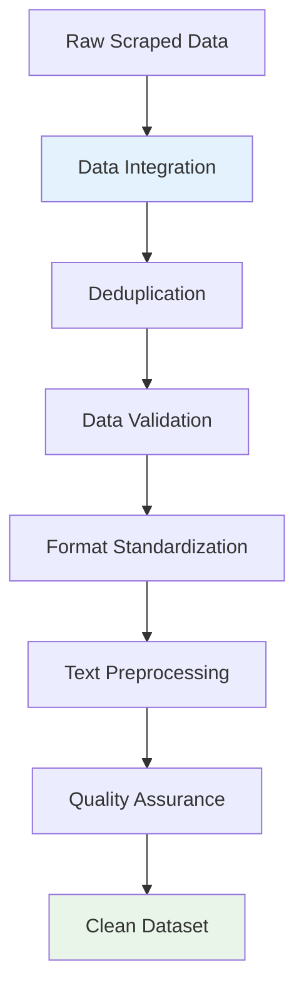

# Data Cleaning: From Raw Scrapes to Clean Data

## Phase Overview

The data cleaning phase transformed our raw scraped data into a clean, consistent dataset by removing duplicates, standardizing formats, and ensuring data quality. This foundational preprocessing step prepared the data for subsequent analysis and pattern discovery.

## Input Data Challenges

### Multiple Data Sources
- **Instant Data Scraper**: Structured tabular data (titles, companies, locations, salaries)
- **WebScraper.io**: Unstructured text data (full job descriptions)
- **Format inconsistencies**: Different CSV structures, encoding issues, missing fields

### Data Quality Issues
- **Duplicate entries**: Same job posted by multiple scrapers or reposted by employers
- **Missing values**: Incomplete job postings, optional fields not filled
- **Inconsistent formatting**: Varying date formats, salary representations, location names
- **Noise data**: Irrelevant jobs, spam postings, outdated listings

### Text Processing Requirements
- **Raw descriptions**: Unstructured text requiring normalization
- **HTML artifacts**: Leftover formatting tags and special characters
- **Language mixing**: German and English content requiring standardization

## Processing Pipeline Architecture



## Processing Stages

### 1. Data Integration & Combining
- **Source alignment**: Match records from different scraping tools
- **Schema unification**: Create consistent data structure
- **Field mapping**: Standardize column names and data types

### 2. Deduplication
- **Similarity matching**: Identify duplicate job postings
- **Content comparison**: Fuzzy matching on job titles and descriptions
- **Temporal handling**: Manage reposted jobs with updated dates

### 3. Data Cleaning & Validation
- **Missing value handling**: Imputation strategies for incomplete data
- **Format standardization**: Normalize dates, salaries, locations
- **Outlier detection**: Identify and handle anomalous data points
- **Data validation**: Ensure consistency and accuracy

### 4. Text Preprocessing
- **HTML cleaning**: Remove markup and formatting artifacts
- **Text normalization**: Standardize case, remove special characters
- **Language processing**: Handle multilingual content appropriately
- **Noise reduction**: Filter irrelevant content

## Technical Implementation

### Python-Based Processing Pipeline

```python
import pandas as pd
import numpy as np
from sklearn.feature_extraction.text import TfidfVectorizer
from sklearn.cluster import KMeans
from sklearn.preprocessing import StandardScaler
import re
from typing import List, Dict, Tuple

class JobMarketDataProcessor:
    """
    Comprehensive data processing pipeline for job market analysis.
    """

    def __init__(self):
        self.vectorizer = TfidfVectorizer(
            max_features=725,
            stop_words='english',
            ngram_range=(1, 2)
        )
        self.scaler = StandardScaler()

    def process_cleaning_pipeline(self, raw_data_path: str) -> pd.DataFrame:
        """
        Data cleaning pipeline: from raw data to clean dataset.
        """
        # Load and combine data sources
        combined_data = self.combine_data_sources(raw_data_path)

        # Remove duplicates
        deduplicated_data = self.deduplicate_jobs(combined_data)

        # Clean and validate data
        cleaned_data = self.clean_and_validate_data(deduplicated_data)

        # Preprocess text
        final_data = self.preprocess_text(cleaned_data)

        return final_data

    def combine_data_sources(self, data_path: str) -> pd.DataFrame:
        """Combine data from Instant Data Scraper and WebScraper.io"""
        # Implementation for data integration
        pass

    def deduplicate_jobs(self, data: pd.DataFrame) -> pd.DataFrame:
        """Remove duplicate job postings"""
        # Implementation for deduplication
        pass

    def clean_and_validate_data(self, data: pd.DataFrame) -> pd.DataFrame:
        """Clean and validate data: handle missing values, standardize formats"""
        # Implementation for data cleaning and validation
        pass

    def preprocess_text(self, data: pd.DataFrame) -> pd.DataFrame:
        """Preprocess text: clean HTML, normalize text, reduce noise"""
        # Implementation for text preprocessing
        pass
```

## Quality Assurance

### Data Validation Checks
- **Completeness**: Ensure required fields are populated
- **Consistency**: Verify data types and value ranges
- **Accuracy**: Cross-reference with source data
- **Uniqueness**: Confirm duplicate removal effectiveness

### Processing Metrics
- **Data loss tracking**: Monitor records removed at each stage
- **Quality improvements**: Measure enhancement in data structure
- **Processing efficiency**: Track computational performance

## Output Data Structure

The cleaned dataset provides:
- **Structured metadata**: Standardized job titles, companies, locations, salaries
- **Quality-assured data**: Validated fields with consistent formatting
- **Deduplicated records**: Single representation of each unique job posting
- **Normalized text**: Clean descriptions ready for analysis
- **Temporal integrity**: Properly handled posting dates and updates

## Foundation for Analysis

### Prepared for Pattern Discovery
- **Clean input data**: Enables reliable clustering and embedding generation
- **Consistent formatting**: Supports accurate similarity comparisons
- **Quality baseline**: Establishes trust in downstream analysis results

### Database Readiness
- **Standardized structure**: Facilitates efficient data storage and querying
- **Validation checks**: Ensures data integrity throughout the pipeline
- **Scalability foundation**: Clean data supports growing dataset requirements

## Navigation

Explore each cleaning stage in detail:

- **[Combining Data Sources](./combining-data)**: Integration of multiple scrapes
- **[Deduplication](./deduplication)**: Duplicate removal strategies
- **[Data Cleanup](./data-cleanup)**: Normalization and validation
- **[Data Inconsistencies](./data-inconsistencies)**: Known quality issues and limitations

### Related Analysis Sections

- **[Embeddings](../data-analysis/embeddings)**: Text representation techniques used on cleaned data
- **[Clustering](../data-analysis/clustering)**: Pattern discovery applied to cleaned dataset
- **[Keyword Tagging](../data-analysis/keyword-tagging)**: Automated categorization of job content
- **[Database Architecture](../data-presentation/database)**: Storage design for cleaned data
