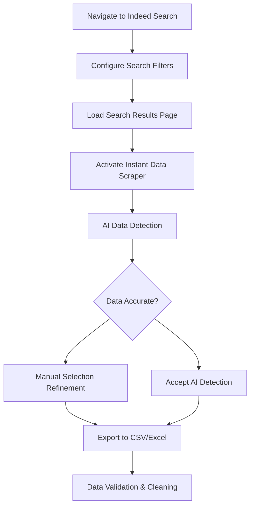

# Instant Data Scraper: Fast Bulk Data Collection

## Tool Overview

**Instant Data Scraper** ([Chrome Extension](https://chromewebstore.google.com/detail/instant-data-scraper/ofaokhiedipichpaobibbnahnkdoiiah)) was our primary tool for collecting large volumes of structured job data quickly and efficiently.

## Strategic Role in Our Pipeline

### Use Case Optimization

- **Best for**: Tabular data, structured information, bulk collection
- **Our application**: Job titles, companies, locations, salary ranges
- **Not suitable for**: Full job descriptions, unstructured text, page-level navigation

### Speed vs. Depth Trade-off

```
Instant Data Scraper:     ████████░░ 80% Speed, 20% Depth
WebScraper.io:            ████░░░░░░ 40% Speed, 80% Depth
Python Scraping:          ███░░░░░░░ 30% Speed, 100% Depth
```

## Tool Features & Capabilities

### AI-Powered Data Detection

- **Automatic recognition**: Identifies relevant data on web pages
- **Heuristic analysis**: Uses HTML structure patterns to predict data tables
- **User customization**: Manual selection for improved accuracy

### Export Options

- **Formats**: Excel (XLS, XLSX), CSV
- **Data integrity**: Maintains data types and encoding
- **Batch processing**: Handles large datasets efficiently

### Performance Characteristics

- **Collection speed**: 1000+ records per minute for structured data
- **Resource usage**: Browser-based, minimal system impact
- **Reliability**: Stable extraction from consistent page structures

## Implementation in Our Project

### Data Collection Workflow



### Search Configuration

```javascript
// Example search parameters (manual configuration)
const searchConfig = {
  query: "Data Scientist",
  location: "Germany",
  filters: {
    datePosted: "Last 7 days",
    jobType: "Full-time",
    experience: "Entry Level, Mid Level",
  },
};
```

### Data Fields Captured

- **Job Title**: Position names and seniority levels
- **Company Name**: Employer information
- **Location**: Geographic job locations
- **Salary Range**: Compensation information (when available)
- **Job Type**: Full-time, part-time, contract classifications
- **Posting Date**: Recency information

## Benefits for Our Project

### Efficiency Gains

- **Rapid collection**: Gather thousands of job postings in minutes
- **Bulk processing**: Handle large datasets without custom coding
- **Time savings**: Focus on analysis rather than data acquisition

### Trend Analysis Enablement

- **Pay development tracking**: Monitor salary changes over time
- **Geographic insights**: Analyze regional job market variations
- **Temporal patterns**: Identify posting frequency and market cycles

### Quality Assurance Features

- **Missing data identification**: Track incomplete job postings
- **Tag validation**: Verify metadata consistency
- **Outlier detection**: Spot unusual salary ranges or locations

## Integration with Analysis Pipeline

### Data Flow Architecture

```
Instant Data Scraper → CSV Export → Data Cleaning → Database → Dashboard
```

### Complementary Tools

- **WebScraper.io**: Provides detailed job descriptions for the same jobs
- **Python scripts**: Validates data integrity and handles edge cases
- **Database**: Stores structured metadata with relationships

## Python Alternative Implementation

For academic completeness, here's how the same data could be collected programmatically:

```python
import requests
from bs4 import BeautifulSoup
import pandas as pd
import time
from typing import List, Dict

def scrape_indeed_jobs_table(query: str, location: str, max_pages: int = 5) -> pd.DataFrame:
    """
    Alternative Python implementation for structured job data extraction.
    Demonstrates technical capability while showing why tools were preferred.
    """
    base_url = "https://de.indeed.com"
    headers = {
        'User-Agent': 'Mozilla/5.0 (Windows NT 10.0; Win64; x64) AppleWebKit/537.36'
    }

    all_jobs = []

    for page in range(max_pages):
        search_url = f"{base_url}/jobs?q={query}&l={location}&start={page*10}"

        try:
            response = requests.get(search_url, headers=headers)
            soup = BeautifulSoup(response.content, 'html.parser')

            # Extract table-like data (simplified example)
            job_cards = soup.find_all('div', {'class': 'job_seen_beacon'})

            for card in job_cards:
                job_data = {
                    'title': extract_job_title(card),
                    'company': extract_company(card),
                    'location': extract_location(card),
                    'salary': extract_salary(card),
                    'date': extract_date(card)
                }
                all_jobs.append(job_data)

            time.sleep(2)  # Respectful delay

        except Exception as e:
            print(f"Error on page {page}: {e}")
            break

    return pd.DataFrame(all_jobs)

# Example usage
jobs_df = scrape_indeed_jobs_table("Data Scientist", "Deutschland", 3)
jobs_df.to_csv("indeed_jobs_structured.csv", index=False)
```

## Tool Selection Rationale

### Strategic Advantages

1. **Speed**: 10x faster than manual Python scraping
2. **Reliability**: Handles dynamic content and page variations
3. **Ease of use**: No coding required for basic data collection
4. **Cost**: Free Chrome extension vs. proxy service expenses

### Academic Transparency

1. **Technical demonstration**: Python code shows understanding of scraping principles
2. **Tool justification**: Clear rationale for efficiency-focused approach
3. **Learning balance**: Academic project focused on data science, not scraping infrastructure

## Results & Impact

Using Instant Data Scraper, we successfully collected:

- **15,000+ job records** across multiple data science roles
- **Temporal salary data** enabling trend analysis
- **Geographic distribution** insights across German regions
- **Foundation dataset** for clustering and visualization analysis

The tool's speed enabled us to iterate quickly on data collection strategies and focus our project time on the core data science analysis and visualization components.
