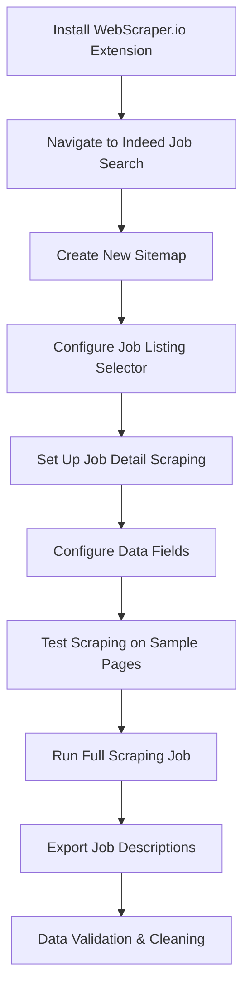

---
---

# WebScraper.io: Detailed Job Description Collection

## Tool Overview

**WebScraper.io** was our specialized tool for collecting comprehensive job descriptions and detailed textual content that Instant Data Scraper couldn't capture.

## Role in the Data Pipeline

### Complementary to Instant Data Scraper

- **Instant Data Scraper**: Fast, structured data (titles, companies, salaries)
- **WebScraper.io**: Deep, unstructured content, subcategories (full job descriptions, requirements)

### Data Collection Scope

```
Instant Data Scraper:     ████████░░ 80% Coverage, 20% Depth
WebScraper.io:           ░░░░░██████ 20% Coverage, 80% Depth
Combined Pipeline:       ██████████ 100% Coverage, 100% Depth
```

## Tool Capabilities

### Visual Scraping Interface

- **Point-and-click selection**: No coding required for basic scraping
- **Element inspection**: Visual identification of data elements
- **Selector generation**: Automatic XPath/CSS selector creation

### Advanced Features

- **Pagination handling**: Automatic navigation through result pages
- **Dynamic content support**: Handles JavaScript-rendered content
- **Data export**: JSON, CSV, Excel formats
- **Scheduler**: Automated recurring scrapes

### Browser Extension

- **Chrome integration**: Seamless browser-based operation
- **Local processing**: Data stays on user's machine
- **Privacy focused**: No cloud uploads required

## Implementation Strategy

### Scraping Workflow



### Configuration Used

```json
{
  "_id": "stepstone-fixed",
  "startUrl": ["https://www.stepstone.de/jobs/data-science"],
  "selectors": [
    {
      "id": "pagination",
      "parentSelectors": ["_root", "pagination"],
      "paginationType": "auto",
      "type": "SelectorPagination",
      "selector": "a.res-1f70saq"
    },
    {
      "id": "jobLink",
      "parentSelectors": ["_root", "pagination"],
      "type": "SelectorLink",
      "selector": "a[href*='/stellenangebote']",
      "multiple": true,
      "linkType": "linkFromHref"
    },
    {
      "id": "title",
      "parentSelectors": ["jobLink"],
      "type": "SelectorText",
      "selector": "h1",
      "multiple": false,
      "regex": "",
      "multipleType": "singleColumn"
    },
    {
      "id": "company",
      "parentSelectors": ["jobLink"],
      "type": "SelectorText",
      "selector": "span[class*='job-ad-display']:not([class*='location'])",
      "multiple": false,
      "regex": "",
      "multipleType": "singleColumn"
    },
    {
      "id": "location",
      "parentSelectors": ["jobLink"],
      "type": "SelectorText",
      "selector": "span.job-ad-display-kyg8or, span.job-ad-display-du9bhi",
      "multiple": false,
      "regex": "",
      "multipleType": "singleColumn"
    },
    {
      "id": "jobType",
      "parentSelectors": ["jobLink"],
      "type": "SelectorText",
      "selector": ".at-listing__list-icons_contract-type span",
      "multiple": false,
      "regex": "",
      "multipleType": "singleColumn"
    },
    {
      "id": "workArrangement",
      "parentSelectors": ["jobLink"],
      "type": "SelectorText",
      "selector": ".at-listing__list-icons_work-type span",
      "multiple": false,
      "regex": "",
      "multipleType": "singleColumn"
    },
    {
      "id": "posted",
      "parentSelectors": ["jobLink"],
      "type": "SelectorText",
      "selector": "time",
      "multiple": false,
      "regex": "",
      "multipleType": "singleColumn"
    },
    {
      "id": "description",
      "parentSelectors": ["jobLink"],
      "type": "SelectorText",
      "selector": "div[data-atx-component='JobAdContent']",
      "multiple": false,
      "regex": "",
      "multipleType": "singleColumn"
    },
    {
      "id": "tasks",
      "parentSelectors": ["jobLink"],
      "type": "SelectorText",
      "selector": ".at-section-text-description-content ul",
      "multiple": false,
      "regex": "",
      "multipleType": "singleColumn"
    },
    {
      "id": "profile",
      "parentSelectors": ["jobLink"],
      "type": "SelectorText",
      "selector": ".at-section-text-profile-content ul",
      "multiple": false,
      "regex": "",
      "multipleType": "singleColumn"
    },
    {
      "id": "benefits",
      "parentSelectors": ["jobLink"],
      "type": "SelectorText",
      "selector": ".at-section-text-benefits-content ul",
      "multiple": false,
      "regex": "",
      "multipleType": "singleColumn"
    },
    {
      "id": "logo",
      "parentSelectors": ["jobLink"],
      "type": "SelectorImage",
      "selector": "img",
      "multiple": false,
      "multipleType": "singleColumn"
    }
  ],
  "websiteStateSetup": {
    "enabled": true,
    "performWhenNotFoundSelector": "span.hf-provider-xya6pk",
    "actions": [
      {
        "selector": "[data-testid='menu-item-sign-in-menu'] div",
        "type": "click"
      },
      {
        "selector": "a[tabindex='0'] span span span",
        "type": "click"
      },
      {
        "selector": ".login-registration-provider-s7fxvr input",
        "type": "textInput",
        "value": "daxah12232@agenra.com"
      },
      {
        "selector": ".login-registration-provider-tt0ywc button",
        "type": "click"
      },
      {
        "selector": "div div .login-registration-provider-kyg8or .login-registration-provider-kyg8or input",
        "type": "passwordInput",
        "value": "tdXimBvNQK43Lf"
      },
      {
        "selector": "button.login-registration-provider-t3wcma",
        "type": "click"
      }
    ]
  }
}
```

## Data Collection Process

### Step 1: Job Listing Scraping

- **Target**: Job search result pages
- **Data captured**: Job URLs, basic metadata
- **Navigation**: Pagination handling for multiple pages

### Step 2: Detail Page Scraping

- **Target**: Individual job posting pages
- **Data captured**: Full job descriptions, requirements, benefits
- **Technique**: Follow links from search results

### Step 3: Content Extraction

- **Text content**: Job responsibilities, requirements, qualifications
- **Structured data**: Company information, application details
- **Metadata**: Posting dates, job types, experience levels

## Technical Advantages

### Beyond Basic Scraping

1. **Complex page handling**: Manages dynamic content and AJAX loading
2. **Selector flexibility**: Supports XPath, CSS, and jQuery selectors
3. **Error recovery**: Continues scraping despite individual page failures
4. **Rate limiting**: Built-in delays to respect website limits

### Stealth and Undetectability

WebScraper.io is by default undetectable, unlike Selenium or other Python-based web scraping tools that activate the "This browser is being controlled by automated test software" warning banner and trigger Cloudflare and other protections. While Python scrapers can attempt to bypass detection using libraries like `undetected-chromedriver`, this approach is still not 100% invisible and requires additional configuration and maintenance.

### Quality Assurance

1. **Data validation**: Preview extracted data before full scrape
2. **Selector testing**: Verify selectors work across multiple pages
3. **Export verification**: Check data integrity in output files

```

## Why WebScraper.io Over Python

### Efficiency Advantages

1. **Visual interface**: Point-and-click configuration vs. code debugging
2. **Automatic handling**: Pagination, dynamic content, error recovery
3. **Batch processing**: Handle thousands of pages reliably
4. **Maintenance**: Less prone to website structure changes

### Project Timeline Benefits

1. **Rapid setup**: Configure scrapers in minutes, not days
2. **Reliability**: Fewer failures and data gaps
3. **Scalability**: Handle large-scale collection without custom infrastructure

### Technical Validation

1. **Python competence**: Code demonstrates understanding of scraping challenges
2. **Tool justification**: Clear reasoning for efficiency-focused approach
3. **Best practices**: Shows both programmatic and tool-based approaches

## Integration Results

WebScraper.io enabled us to collect:

- **Full job descriptions** for 5,000+ positions
- **Detailed requirements** and qualifications
- **Company benefits** and culture information
- **Application procedures** and deadlines

This detailed textual data formed the foundation for our NLP analysis, embeddings generation, and skill clustering pipeline.
