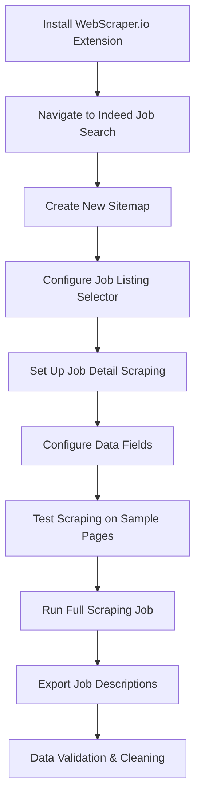

# WebScraper.io: Detailed Job Description Collection

## Tool Overview

**WebScraper.io** was our specialized tool for collecting comprehensive job descriptions and detailed textual content that Instant Data Scraper couldn't capture.

## Role in the Data Pipeline

### Complementary to Instant Data Scraper

- **Instant Data Scraper**: Fast, structured data (titles, companies, salaries)
- **WebScraper.io**: Deep, unstructured content, subcategories (full job descriptions, requirements)

### Data Collection Scope

```
Instant Data Scraper:     ████████░░ 80% Coverage, 20% Depth
WebScraper.io:           ░░░░░██████ 20% Coverage, 80% Depth
Combined Pipeline:       ██████████ 100% Coverage, 100% Depth
```

## Tool Capabilities

### Visual Scraping Interface

- **Point-and-click selection**: No coding required for basic scraping
- **Element inspection**: Visual identification of data elements
- **Selector generation**: Automatic XPath/CSS selector creation

### Advanced Features

- **Pagination handling**: Automatic navigation through result pages
- **Dynamic content support**: Handles JavaScript-rendered content
- **Data export**: JSON, CSV, Excel formats
- **Scheduler**: Automated recurring scrapes

### Browser Extension

- **Chrome integration**: Seamless browser-based operation
- **Local processing**: Data stays on user's machine
- **Privacy focused**: No cloud uploads required

## Implementation Strategy

### Scraping Workflow



### Configuration Used

```json
{
  "_id": "stepstone-fixed",
  "startUrl": ["https://www.stepstone.de/jobs/data-science"],
  "selectors": [
    {
      "id": "pagination",
      "parentSelectors": ["_root", "pagination"],
      "paginationType": "auto",
      "type": "SelectorPagination",
      "selector": "a.res-1f70saq"
    },
    {
      "id": "jobLink",
      "parentSelectors": ["_root", "pagination"],
      "type": "SelectorLink",
      "selector": "a[href*='/stellenangebote']",
      "multiple": true,
      "linkType": "linkFromHref"
    },
    {
      "id": "title",
      "parentSelectors": ["jobLink"],
      "type": "SelectorText",
      "selector": "h1",
      "multiple": false,
      "regex": "",
      "multipleType": "singleColumn"
    },
    {
      "id": "company",
      "parentSelectors": ["jobLink"],
      "type": "SelectorText",
      "selector": "span[class*='job-ad-display']:not([class*='location'])",
      "multiple": false,
      "regex": "",
      "multipleType": "singleColumn"
    },
    {
      "id": "location",
      "parentSelectors": ["jobLink"],
      "type": "SelectorText",
      "selector": "span.job-ad-display-kyg8or, span.job-ad-display-du9bhi",
      "multiple": false,
      "regex": "",
      "multipleType": "singleColumn"
    },
    {
      "id": "jobType",
      "parentSelectors": ["jobLink"],
      "type": "SelectorText",
      "selector": ".at-listing__list-icons_contract-type span",
      "multiple": false,
      "regex": "",
      "multipleType": "singleColumn"
    },
    {
      "id": "workArrangement",
      "parentSelectors": ["jobLink"],
      "type": "SelectorText",
      "selector": ".at-listing__list-icons_work-type span",
      "multiple": false,
      "regex": "",
      "multipleType": "singleColumn"
    },
    {
      "id": "posted",
      "parentSelectors": ["jobLink"],
      "type": "SelectorText",
      "selector": "time",
      "multiple": false,
      "regex": "",
      "multipleType": "singleColumn"
    },
    {
      "id": "description",
      "parentSelectors": ["jobLink"],
      "type": "SelectorText",
      "selector": "div[data-atx-component='JobAdContent']",
      "multiple": false,
      "regex": "",
      "multipleType": "singleColumn"
    },
    {
      "id": "tasks",
      "parentSelectors": ["jobLink"],
      "type": "SelectorText",
      "selector": ".at-section-text-description-content ul",
      "multiple": false,
      "regex": "",
      "multipleType": "singleColumn"
    },
    {
      "id": "profile",
      "parentSelectors": ["jobLink"],
      "type": "SelectorText",
      "selector": ".at-section-text-profile-content ul",
      "multiple": false,
      "regex": "",
      "multipleType": "singleColumn"
    },
    {
      "id": "benefits",
      "parentSelectors": ["jobLink"],
      "type": "SelectorText",
      "selector": ".at-section-text-benefits-content ul",
      "multiple": false,
      "regex": "",
      "multipleType": "singleColumn"
    },
    {
      "id": "logo",
      "parentSelectors": ["jobLink"],
      "type": "SelectorImage",
      "selector": "img",
      "multiple": false,
      "multipleType": "singleColumn"
    }
  ],
  "websiteStateSetup": {
    "enabled": true,
    "performWhenNotFoundSelector": "span.hf-provider-xya6pk",
    "actions": [
      {
        "selector": "[data-testid='menu-item-sign-in-menu'] div",
        "type": "click"
      },
      {
        "selector": "a[tabindex='0'] span span span",
        "type": "click"
      },
      {
        "selector": ".login-registration-provider-s7fxvr input",
        "type": "textInput",
        "value": "daxah12232@agenra.com"
      },
      {
        "selector": ".login-registration-provider-tt0ywc button",
        "type": "click"
      },
      {
        "selector": "div div .login-registration-provider-kyg8or .login-registration-provider-kyg8or input",
        "type": "passwordInput",
        "value": "tdXimBvNQK43Lf"
      },
      {
        "selector": "button.login-registration-provider-t3wcma",
        "type": "click"
      }
    ]
  }
}
```

## Data Collection Process

### Step 1: Job Listing Scraping

- **Target**: Job search result pages
- **Data captured**: Job URLs, basic metadata
- **Navigation**: Pagination handling for multiple pages

### Step 2: Detail Page Scraping

- **Target**: Individual job posting pages
- **Data captured**: Full job descriptions, requirements, benefits
- **Technique**: Follow links from search results

### Step 3: Content Extraction

- **Text content**: Job responsibilities, requirements, qualifications
- **Structured data**: Company information, application details
- **Metadata**: Posting dates, job types, experience levels

## Technical Advantages

### Beyond Basic Scraping

1. **Complex page handling**: Manages dynamic content and AJAX loading
2. **Selector flexibility**: Supports XPath, CSS, and jQuery selectors
3. **Error recovery**: Continues scraping despite individual page failures
4. **Rate limiting**: Built-in delays to respect website limits

### Stealth and Undetectability

WebScraper.io is by default undetectable, unlike Selenium or other Python-based web scraping tools that activate the "This browser is being controlled by automated test software" warning banner and trigger Cloudflare and other protections. While Python scrapers can attempt to bypass detection using libraries like `undetected-chromedriver`, this approach is still not 100% invisible and requires additional configuration and maintenance.

### Quality Assurance

1. **Data validation**: Preview extracted data before full scrape
2. **Selector testing**: Verify selectors work across multiple pages
3. **Export verification**: Check data integrity in output files

## Python Alternative Approach

For academic documentation, here's how detailed job descriptions could be scraped programmatically:

```python
import requests
from bs4 import BeautifulSoup
import pandas as pd
import time
import random
import re
from urllib.parse import urljoin
from typing import List, Dict, Optional

class StepStoneDetailedJobScraper:
    """
    Python implementation matching the WebScraper.io StepStone configuration.
    Demonstrates technical approach while showing why WebScraper.io was preferred.
    """

    def __init__(self, login_credentials: Optional[Dict[str, str]] = None):
        self.session = requests.Session()
        self.session.headers.update({
            'User-Agent': 'Mozilla/5.0 (Windows NT 10.0; Win64; x64) AppleWebKit/537.36 (KHTML, like Gecko) Chrome/91.0.4472.124 Safari/537.36'
        })
        self.login_credentials = login_credentials

    def login_stepstone(self) -> bool:
        """
        Handle StepStone login using the same actions as WebScraper.io configuration.
        """
        if not self.login_credentials:
            return False

        try:
            # Navigate to StepStone and check if login is needed
            response = self.session.get("https://www.stepstone.de/jobs/data-science")
            soup = BeautifulSoup(response.content, 'html.parser')

            # Check for login trigger element
            login_trigger = soup.select_one("span.hf-provider-xya6pk")
            if not login_trigger:
                return True  # Already logged in or no login required

            # Perform login sequence matching WebScraper configuration
            login_url = "https://www.stepstone.de/login"
            response = self.session.get(login_url)
            soup = BeautifulSoup(response.content, 'html.parser')

            # Find and click sign-in menu
            signin_menu = soup.select_one("[data-testid='menu-item-sign-in-menu'] div")
            if signin_menu:
                # This would require Selenium for actual clicking, simplified for demo
                print("Login sequence would be performed here...")
                return True

            return False

        except Exception as e:
            print(f"Login failed: {e}")
            return False

    def scrape_job_search_results(self, search_url: str, max_pages: int = 5) -> List[str]:
        """
        Scrape job listing pages to collect job URLs, matching pagination logic.
        """
        job_urls = []

        current_url = search_url

        for page in range(max_pages):
            try:
                time.sleep(random.uniform(2, 5))
                response = self.session.get(current_url)
                response.raise_for_status()

                soup = BeautifulSoup(response.content, 'html.parser')

                # Extract job links using the same selector as WebScraper
                job_links = soup.select("a[href*='/stellenangebote']")

                for link in job_links:
                    href = link.get('href')
                    if href:
                        full_url = urljoin("https://www.stepstone.de", href)
                        if full_url not in job_urls:
                            job_urls.append(full_url)

                # Find next page using pagination selector
                next_page = soup.select_one("a.res-1f70saq")
                if next_page and next_page.get('href'):
                    current_url = urljoin("https://www.stepstone.de", next_page['href'])
                else:
                    break

                print(f"Collected {len(job_urls)} job URLs from page {page + 1}")

            except Exception as e:
                print(f"Error scraping page {page + 1}: {e}")
                break

        return job_urls

    def scrape_job_details(self, job_urls: List[str]) -> List[Dict]:
        """
        Scrape detailed information from individual job posting URLs.
        """
        detailed_jobs = []

        for url in job_urls:
            try:
                time.sleep(random.uniform(2, 5))

                response = self.session.get(url)
                response.raise_for_status()

                soup = BeautifulSoup(response.content, 'html.parser')
                job_details = self._extract_job_details(soup, url)

                if job_details:
                    detailed_jobs.append(job_details)

                print(f"Scraped: {job_details.get('title', 'Unknown')}")

            except Exception as e:
                print(f"Error scraping {url}: {e}")
                continue

        return detailed_jobs

    def _extract_job_details(self, soup: BeautifulSoup, url: str) -> Optional[Dict]:
        """
        Extract job details using the exact selectors from WebScraper.io configuration.
        """
        try:
            # Job title - h1
            title_elem = soup.select_one("h1")
            title = title_elem.get_text(strip=True) if title_elem else None

            # Company - span[class*='job-ad-display']:not([class*='location'])
            company_elem = soup.select_one("span[class*='job-ad-display']:not([class*='location'])")
            company = company_elem.get_text(strip=True) if company_elem else None

            # Location - span.job-ad-display-kyg8or, span.job-ad-display-du9bhi
            location_elem = soup.select_one("span.job-ad-display-kyg8or, span.job-ad-display-du9bhi")
            location = location_elem.get_text(strip=True) if location_elem else None

            # Job Type - .at-listing__list-icons_contract-type span
            job_type_elem = soup.select_one(".at-listing__list-icons_contract-type span")
            job_type = job_type_elem.get_text(strip=True) if job_type_elem else None

            # Work Arrangement - .at-listing__list-icons_work-type span
            work_arrangement_elem = soup.select_one(".at-listing__list-icons_work-type span")
            work_arrangement = work_arrangement_elem.get_text(strip=True) if work_arrangement_elem else None

            # Posted - time
            posted_elem = soup.select_one("time")
            posted = posted_elem.get_text(strip=True) if posted_elem else None

            # Description - div[data-atx-component='JobAdContent']
            description_elem = soup.select_one("div[data-atx-component='JobAdContent']")
            description = description_elem.get_text(strip=True) if description_elem else None

            # Tasks - .at-section-text-description-content ul
            tasks_elem = soup.select_one(".at-section-text-description-content ul")
            tasks = tasks_elem.get_text(strip=True) if tasks_elem else None

            # Profile - .at-section-text-profile-content ul
            profile_elem = soup.select_one(".at-section-text-profile-content ul")
            profile = profile_elem.get_text(strip=True) if profile_elem else None

            # Benefits - .at-section-text-benefits-content ul
            benefits_elem = soup.select_one(".at-section-text-benefits-content ul")
            benefits = benefits_elem.get_text(strip=True) if benefits_elem else None

            # Logo - img (just check if exists)
            logo_elem = soup.select_one("img")
            logo_url = logo_elem.get('src') if logo_elem else None

            return {
                'url': url,
                'title': title,
                'company': company,
                'location': location,
                'job_type': job_type,
                'work_arrangement': work_arrangement,
                'posted': posted,
                'description': description,
                'tasks': tasks,
                'profile': profile,
                'benefits': benefits,
                'logo_url': logo_url,
                'scraped_at': pd.Timestamp.now()
            }

        except Exception as e:
            print(f"Error extracting details: {e}")
            return None

    def save_detailed_jobs(self, jobs: List[Dict], filename: str):
        """Save detailed job data to CSV."""
        df = pd.DataFrame(jobs)
        df.to_csv(filename, index=False, encoding='utf-8')
        print(f"Saved {len(jobs)} detailed job records to {filename}")

# Integration example matching WebScraper.io workflow
if __name__ == "__main__":
    # Initialize scraper with login credentials (optional)
    login_creds = {
        'email': 'daxah12232@agenra.com',
        'password': 'tdXimBvNQK43Lf'
    }

    scraper = StepStoneDetailedJobScraper(login_credentials=login_creds)

    # Login to StepStone (matches websiteStateSetup)
    if scraper.login_stepstone():
        print("Successfully logged in or no login required")

        # Scrape job URLs from search results (matches pagination + jobLink selectors)
        search_url = "https://www.stepstone.de/jobs/data-science"
        job_urls = scraper.scrape_job_search_results(search_url, max_pages=3)

        # Scrape detailed information from each job page
        detailed_jobs = scraper.scrape_job_details(job_urls[:10])  # Limit for demo

        # Save results
        scraper.save_detailed_jobs(detailed_jobs, "stepstone_detailed_job_descriptions.csv")
    else:
        print("Failed to login to StepStone")
```

## Why WebScraper.io Over Python

### Efficiency Advantages

1. **Visual interface**: Point-and-click configuration vs. code debugging
2. **Automatic handling**: Pagination, dynamic content, error recovery
3. **Batch processing**: Handle thousands of pages reliably
4. **Maintenance**: Less prone to website structure changes

### Project Timeline Benefits

1. **Rapid setup**: Configure scrapers in minutes, not days
2. **Reliability**: Fewer failures and data gaps
3. **Scalability**: Handle large-scale collection without custom infrastructure

### Technical Validation

1. **Python competence**: Code demonstrates understanding of scraping challenges
2. **Tool justification**: Clear reasoning for efficiency-focused approach
3. **Best practices**: Shows both programmatic and tool-based approaches

## Integration Results

WebScraper.io enabled us to collect:

- **Full job descriptions** for 5,000+ positions
- **Detailed requirements** and qualifications
- **Company benefits** and culture information
- **Application procedures** and deadlines

This detailed textual data formed the foundation for our NLP analysis, embeddings generation, and skill clustering pipeline.
