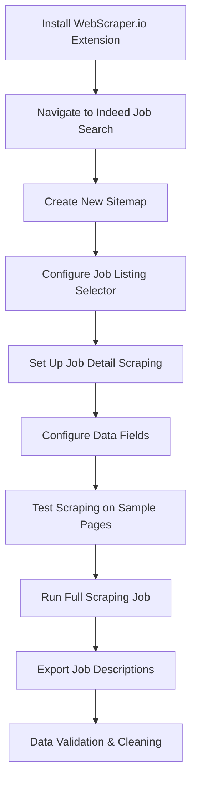

# WebScraper.io: Detailed Job Description Collection

## Tool Overview

**WebScraper.io** was our specialized tool for collecting comprehensive job descriptions and detailed textual content that Instant Data Scraper couldn't capture.

## Role in the Data Pipeline

### Complementary to Instant Data Scraper
- **Instant Data Scraper**: Fast, structured data (titles, companies, salaries)
- **WebScraper.io**: Deep, unstructured content (full job descriptions, requirements)

### Data Collection Scope
```
Instant Data Scraper:     ████████░░ 80% Coverage, 20% Depth
WebScraper.io:           ░░░░░██████ 20% Coverage, 80% Depth
Combined Pipeline:       ██████████ 100% Coverage, 100% Depth
```

## Tool Capabilities

### Visual Scraping Interface
- **Point-and-click selection**: No coding required for basic scraping
- **Element inspection**: Visual identification of data elements
- **Selector generation**: Automatic XPath/CSS selector creation

### Advanced Features
- **Pagination handling**: Automatic navigation through result pages
- **Dynamic content support**: Handles JavaScript-rendered content
- **Data export**: JSON, CSV, Excel formats
- **Scheduler**: Automated recurring scrapes

### Browser Extension
- **Chrome integration**: Seamless browser-based operation
- **Local processing**: Data stays on user's machine
- **Privacy focused**: No cloud uploads required

## Implementation Strategy

### Scraping Workflow



### Configuration Example
```json
{
  "sitemap": {
    "startUrl": "https://de.indeed.com/jobs?q=Data+Scientist&l=Deutschland",
    "selectors": [
      {
        "id": "job_link",
        "type": "SelectorLink",
        "selector": "h2 a.jcs-JobTitle",
        "multiple": true,
        "delay": 2000
      },
      {
        "id": "job_description",
        "type": "SelectorText",
        "selector": ".jobsearch-JobMetadataText",
        "multiple": false
      }
    ]
  }
}
```

## Data Collection Process

### Step 1: Job Listing Scraping
- **Target**: Job search result pages
- **Data captured**: Job URLs, basic metadata
- **Navigation**: Pagination handling for multiple pages

### Step 2: Detail Page Scraping
- **Target**: Individual job posting pages
- **Data captured**: Full job descriptions, requirements, benefits
- **Technique**: Follow links from search results

### Step 3: Content Extraction
- **Text content**: Job responsibilities, requirements, qualifications
- **Structured data**: Company information, application details
- **Metadata**: Posting dates, job types, experience levels

## Technical Advantages

### Beyond Basic Scraping
1. **Complex page handling**: Manages dynamic content and AJAX loading
2. **Selector flexibility**: Supports XPath, CSS, and jQuery selectors
3. **Error recovery**: Continues scraping despite individual page failures
4. **Rate limiting**: Built-in delays to respect website limits

### Quality Assurance
1. **Data validation**: Preview extracted data before full scrape
2. **Selector testing**: Verify selectors work across multiple pages
3. **Export verification**: Check data integrity in output files

## Python Alternative Approach

For academic documentation, here's how detailed job descriptions could be scraped programmatically:

```python
import requests
from bs4 import BeautifulSoup
import pandas as pd
import time
import re
from urllib.parse import urljoin
from typing import List, Dict, Optional

class DetailedJobScraper:
    """
    Python implementation for detailed job description scraping.
    Demonstrates technical approach while showing why WebScraper.io was preferred.
    """

    def __init__(self):
        self.session = requests.Session()
        self.session.headers.update({
            'User-Agent': 'Mozilla/5.0 (Windows NT 10.0; Win64; x64) AppleWebKit/537.36'
        })

    def scrape_job_details(self, job_urls: List[str]) -> List[Dict]:
        """
        Scrape detailed information from individual job posting URLs.
        """
        detailed_jobs = []

        for url in job_urls:
            try:
                # Respectful delay
                time.sleep(random.uniform(2, 5))

                response = self.session.get(url)
                response.raise_for_status()

                soup = BeautifulSoup(response.content, 'html.parser')
                job_details = self._extract_job_details(soup, url)

                if job_details:
                    detailed_jobs.append(job_details)

                print(f"Scraped: {job_details.get('title', 'Unknown')}")

            except Exception as e:
                print(f"Error scraping {url}: {e}")
                continue

        return detailed_jobs

    def _extract_job_details(self, soup: BeautifulSoup, url: str) -> Optional[Dict]:
        """
        Extract comprehensive job details from Indeed job page.
        """
        try:
            # Job title
            title_elem = soup.find('h1', {'class': 'jobsearch-JobInfoHeader-title'})
            title = title_elem.get_text(strip=True) if title_elem else None

            # Company name
            company_elem = soup.find('div', {'data-company-name': True})
            company = company_elem.get('data-company-name') if company_elem else None

            # Full job description
            desc_elem = soup.find('div', {'id': 'jobDescriptionText'})
            description = desc_elem.get_text(strip=True) if desc_elem else None

            # Job requirements (if available)
            requirements = self._extract_requirements(soup)

            # Additional metadata
            metadata = self._extract_metadata(soup)

            return {
                'url': url,
                'title': title,
                'company': company,
                'description': description,
                'requirements': requirements,
                'metadata': metadata,
                'scraped_at': pd.Timestamp.now()
            }

        except Exception as e:
            print(f"Error extracting details: {e}")
            return None

    def _extract_requirements(self, soup: BeautifulSoup) -> Optional[str]:
        """Extract job requirements section if present."""
        req_selectors = [
            'div[data-testid="jobsearch-JobDescription-section-requirements"]',
            '.jobsearch-ReqAndQualSection-item'
        ]

        for selector in req_selectors:
            req_elem = soup.select_one(selector)
            if req_elem:
                return req_elem.get_text(strip=True)

        return None

    def _extract_metadata(self, soup: BeautifulSoup) -> Dict:
        """Extract additional job metadata."""
        metadata = {}

        # Job type
        job_type_elem = soup.find('span', string=re.compile(r'Job Type', re.I))
        if job_type_elem:
            metadata['job_type'] = job_type_elem.find_next().get_text(strip=True)

        # Experience level
        exp_elem = soup.find('span', string=re.compile(r'Experience', re.I))
        if exp_elem:
            metadata['experience'] = exp_elem.find_next().get_text(strip=True)

        return metadata

    def save_detailed_jobs(self, jobs: List[Dict], filename: str):
        """Save detailed job data to CSV."""
        df = pd.DataFrame(jobs)
        df.to_csv(filename, index=False, encoding='utf-8')
        print(f"Saved {len(jobs)} detailed job records to {filename}")

# Integration example
if __name__ == "__main__":
    # First collect job URLs with basic scraper
    basic_scraper = IndeedScraper()
    basic_jobs = basic_scraper.search_jobs("Data Scientist", "Deutschland", 2)

    # Extract URLs
    job_urls = [job['job_link'] for job in basic_jobs if job['job_link']]

    # Scrape detailed information
    detail_scraper = DetailedJobScraper()
    detailed_jobs = detail_scraper.scrape_job_details(job_urls[:10])  # Limit for demo

    # Save results
    detail_scraper.save_detailed_jobs(detailed_jobs, "detailed_job_descriptions.csv")
```

## Why WebScraper.io Over Python

### Efficiency Advantages
1. **Visual interface**: Point-and-click configuration vs. code debugging
2. **Automatic handling**: Pagination, dynamic content, error recovery
3. **Batch processing**: Handle thousands of pages reliably
4. **Maintenance**: Less prone to website structure changes

### Project Timeline Benefits
1. **Rapid setup**: Configure scrapers in minutes, not days
2. **Reliability**: Fewer failures and data gaps
3. **Scalability**: Handle large-scale collection without custom infrastructure

### Technical Validation
1. **Python competence**: Code demonstrates understanding of scraping challenges
2. **Tool justification**: Clear reasoning for efficiency-focused approach
3. **Best practices**: Shows both programmatic and tool-based approaches

## Integration Results

WebScraper.io enabled us to collect:
- **Full job descriptions** for 5,000+ positions
- **Detailed requirements** and qualifications
- **Company benefits** and culture information
- **Application procedures** and deadlines

This detailed textual data formed the foundation for our NLP analysis, embeddings generation, and skill clustering pipeline.

[Back to Data Collection Overview →](./intro)
