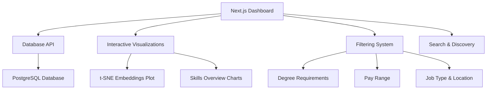

# Data Presentation: Interactive Dashboard & Visualizations

## Phase Overview

The data presentation phase transformed our processed job market data into an interactive, customizable dashboard. Using Next.js, we created a web application that enables users to explore data science career opportunities through filtering, visualization, and skill analysis.

## Presentation Goals

### User-Centric Design

- **Intuitive navigation**: Easy-to-use interface for job seekers and researchers
- **Customizable views**: Flexible filtering and exploration options
- **Real-time insights**: Interactive visualizations that respond to user selections
- **Performance optimized**: Fast loading and smooth interactions

### Analytical Depth

- **Multi-dimensional filtering**: Combine criteria across salary, skills, location, and experience
- **Visual exploration**: t-SNE embeddings visualization for pattern discovery
- **Skill intelligence**: Understand market demands and trends
- **Career guidance**: Support informed decision-making for data science careers

## Technical Architecture

### Next.js Framework Selection

**Why Next.js was chosen:**

- **Already experienced**: Team had existing familiarity with React/Next.js
- **Flexible**: Supports fullstack applications with API routes
- **Industry standard**: Widely adopted for production web applications
- **Public deployment**: Enables easy sharing and accessibility

### Dashboard Features Overview

## Key Dashboard Components

### 1. Job Discovery Interface

- **Search functionality**: Find jobs by keywords, companies, or titles
- **Results display**: Paginated, sortable job listings with key information
- **Detail views**: Expandable job descriptions and requirements

### 2. Advanced Filtering System

- **Degree requirements**: Filter by education level needs
- **Pay range**: Salary-based filtering with distribution visualization
- **Job type**: Full-time, part-time, contract, internship options
- **Work time**: Flexible hours, remote work preferences
- **Location**: Geographic filtering with city/state selection

### 3. Data Visualizations

- **t-SNE visualization**: 725D embeddings reduced to 2D/3D for exploration
- **Skills overview**: Market demand analysis for key technologies
- **Salary distributions**: Compensation insights by role and location
- **Trend analysis**: Temporal patterns in job postings and requirements

### 4. Skills Intelligence

- **Market demand**: Which skills are most requested currently
- **Salary correlation**: How skills impact compensation
- **Regional variations**: Skill preferences by geographic location
- **Emerging trends**: New technologies gaining traction

## User Experience Design

### Accessibility & Usability

- **Responsive design**: Works on desktop, tablet, and mobile devices
- **Loading states**: Clear feedback during data fetching
- **Error handling**: Graceful failure recovery with user guidance
- **Progressive enhancement**: Core functionality works without JavaScript

### Performance Optimization

- **Lazy loading**: Components load as needed
- **Caching**: Database query results cached for repeated requests
- **Pagination**: Large datasets handled efficiently
- **CDN deployment**: Fast global content delivery

## Data Privacy & Ethics

### User Data Protection

- **No personal tracking**: Anonymous usage analytics only
- **Local processing**: Sensitive operations handled server-side
- **Data minimization**: Only necessary data collected for functionality

### Academic Integrity

- **Transparent sourcing**: Clear attribution to original data sources
- **Educational purpose**: Designed for learning and career guidance
- **Research ethics**: Respects platform terms and user privacy

## Navigation

Explore the dashboard implementation in detail:

- **[Dashboard Architecture](./dashboard)**: Next.js setup and API design
- **[Filtering System](./filtering)**: Advanced query and filter implementation
- **[t-SNE Visualization](./tsne-visualization)**: Dimensionality reduction and interactive plotting
- **[Skills Overview](./skills-overview)**: Market intelligence and trend analysis

The dashboard represents the culmination of our data science pipeline, transforming complex analyses into actionable insights for data science career planning.
