# Project Journey: From Concept to Interactive Dashboard

## Overview

This page provides a high-level overview of the complete **Job Market Insights** project journey. The project evolved through multiple phases, from initial brainstorming and data collection challenges to advanced analysis and interactive visualization.

## Project Timeline

```mermaid
flowchart LR
    %% Collection Column
    subgraph "📊 Collection<br/><em style='color:#60a5fa'>Data Gathering</em>"
        A1[Brainstorming<br/>Topic Selection]
        A2[Stepstone<br/>Challenges]
        A3[Indeed<br/>Platform]
        A4[Multi-Tool<br/>Scraping]
    end

    %% Cleaning Column
    subgraph "🧹 Cleaning<br/><em style='color:#34d399'>Data Quality</em>"
        B1[Data Integration<br/>& Deduplication]
        B2[Quality Assurance<br/>& Validation]
    end

    %% Analysis Column
    subgraph "🔍 Analysis<br/><em style='color:#8b5cf6'>Pattern Discovery</em>"
        C1[Text Analysis<br/>725D Embeddings]
        C2[Clustering<br/>Skill Groups]
        C3[Keyword<br/>Extraction]
    end

    %% Presentation Column
    subgraph "🎨 Presentation<br/><em style='color:#fbbf24'>Visualization</em>"
        D1[Database<br/>Architecture]
        D2[Next.js<br/>Dashboard]
        D3[t-SNE<br/>Visualization]
        D4[Interactive<br/>Filtering]
    end

    %% Vertical flow within each column
    A1 --> A2 --> A3 --> A4
    B1 --> B2
    C1 --> C2 --> C3
    D1 --> D2 --> D3 --> D4

    %% Horizontal flow between columns
    A4 --> B1
    B2 --> C1
    C3 --> D1

    %% Collection styling
    style A1 fill:#1e40af,stroke:#60a5fa,stroke-width:3px,color:#ffffff
    style A2 fill:#1e40af,stroke:#60a5fa,stroke-width:3px,color:#ffffff
    style A3 fill:#1e40af,stroke:#60a5fa,stroke-width:3px,color:#ffffff
    style A4 fill:#1e40af,stroke:#60a5fa,stroke-width:3px,color:#ffffff

    %% Cleaning styling
    style B1 fill:#065f46,stroke:#34d399,stroke-width:3px,color:#ffffff
    style B2 fill:#065f46,stroke:#34d399,stroke-width:3px,color:#ffffff

    %% Analysis styling
    style C1 fill:#5b21b6,stroke:#8b5cf6,stroke-width:3px,color:#ffffff
    style C2 fill:#5b21b6,stroke:#8b5cf6,stroke-width:3px,color:#ffffff
    style C3 fill:#5b21b6,stroke:#8b5cf6,stroke-width:3px,color:#ffffff

    %% Presentation styling
    style D1 fill:#92400e,stroke:#fbbf24,stroke-width:3px,color:#ffffff
    style D2 fill:#92400e,stroke:#fbbf24,stroke-width:3px,color:#ffffff
    style D3 fill:#92400e,stroke:#fbbf24,stroke-width:3px,color:#ffffff
    style D4 fill:#92400e,stroke:#fbbf24,stroke-width:3px,color:#ffffff
```

## Phase Breakdown

### 1. Brainstorming & Topic Selection

- **Initial ideas**: News media biases vs. Job market analysis for data science
- **Decision factor**: Relevance to students' lives and career planning
- **Selected topic**: Job market analysis for data science degrees

### 2. Data Collection Challenges

- **Initial attempt**: Stepstone scraping
- **Challenges encountered**:
  - Cloudflare captcha every 10 job posts
  - IP blocking after limited requests
  - Proxy/VPN solutions too complex and costly
- **Solution**: Switch to Indeed (no anti-bot detection)

### 3. Multi-Tool Scraping Approach

- **Instant Data Scraper**: Fast collection of job names, companies, locations, pay
- **WebScraper.io**: Comprehensive job description scraping
- **Rationale**: Balance speed vs. depth, strategic tool usage

### 4. Data Cleaning

- **Data integration**: Combine multiple scrapes (titles, pay, industry parameters)
- **Deduplication**: Remove redundant entries and duplicates
- **Quality assurance**: Validate data consistency and completeness
- **Foundation**: Prepare clean dataset for pattern analysis

### 5. Data Analysis

- **Text embeddings**: 725-dimensional vector representations of job descriptions
- **Pattern discovery**: K-means clustering to identify skill-based job groups
- **Schema extraction**: Automated keyword tagging and categorization
- **Insight generation**: Uncover hidden relationships in job market data

### 6. Data Architecture

- **Database design**: Handle complex, timestamped, multi-layer keyword data
- **Scalability**: Support for growing dataset and analysis requirements
- **Data modeling**: Structure analytical results for efficient querying

### 7. Data Presentation

- **Next.js dashboard**: Fullstack web application with public deployment
- **t-SNE visualization**: Dimensionality reduction for embedding exploration
- **Filtering system**: Degree requirements, pay ranges, job types, locations

## Key Technical Decisions

### Why Multiple Scraping Tools?

- **Speed vs. Depth**: Instant Data Scraper for bulk data, WebScraper.io for details
- **Academic integrity**: Demonstrated Python knowledge while using appropriate tools
- **Practical constraints**: Balance between automation and reliability

### Why 725-Dimensional Embeddings?

- **Rich representation**: Capture semantic meaning beyond simple keywords
- **Clustering effectiveness**: Sufficient dimensionality for meaningful groupings
- **Analysis capability**: Support complex pattern recognition in job descriptions

### Why t-SNE for Visualization?

- **Dimensionality reduction**: Transform 725D embeddings to 2D/3D for visualization
- **Non-linear relationships**: Preserve local structure in high-dimensional space
- **Interactive exploration**: Enable users to navigate job market clusters

## Detailed Documentation Sections

Explore each phase in detail:

- **[Data Collection](./data-collection/intro)**: Technical challenges and solutions
- **[Data Cleaning](./data-cleaning/intro)**: Deduplication and quality assurance
- **[Data Analysis](./data-analysis/intro)**: Pattern discovery and schema extraction
- **[Data Presentation](./data-presentation/intro)**: Dashboard and visualization features
- **[Limitations](./conclusion/limitations)**: Project constraints and future improvements

## Project Outcomes

The journey resulted in a comprehensive job market analysis tool that provides:

- Real-time insights into data science career opportunities
- Interactive exploration of skill requirements and salary ranges
- Practical experience with modern data science workflows
- Demonstrated ability to overcome technical challenges in web scraping and analysis
